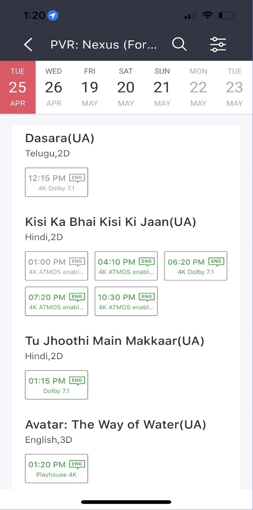

# Book My Show APIs

Please refer following [postman documentation](https://documenter.getpostman.com/view/12674486/2s93m1bQWN) for using endpoints.

# Data Models

```
shows{
	id
	start-time
	end-time
	date
	movieId        // Foreign Key
	screenId       // Foreign Key
	theatreId      // Foreign Key
}

theatres{
	id
	name
	addressId      // Foreign Key
}

screens{
	id
	number
	audio
	video
	theatreId      // Foreign Key
}

addresses{
	pincode
	city
	state
	country
}

movies {
	id
	name
	description
	genre
}

bookings{
	id
	showId		// Foreign Key
	userId		// Foreign Key
	seatNum
}
```

# Project Title: Problem Solving Case: bookmyshow

## Breif

Bookmyshow is a ticketing platform where you can book tickets for a movie show. As part of this assignment, we need to build API’s for the following feature. As a user, I can select any theatre in the city. On selecting the theatre, I should be able to see the dates of next 7 days. I can click on any date and the page should load to give me all the movies in that theatre on that given date. Movies should contain details of all the showtimes.

The image attached represents the feature described above. You have to code the APIs along with appropriate table structures for powering this UI.


